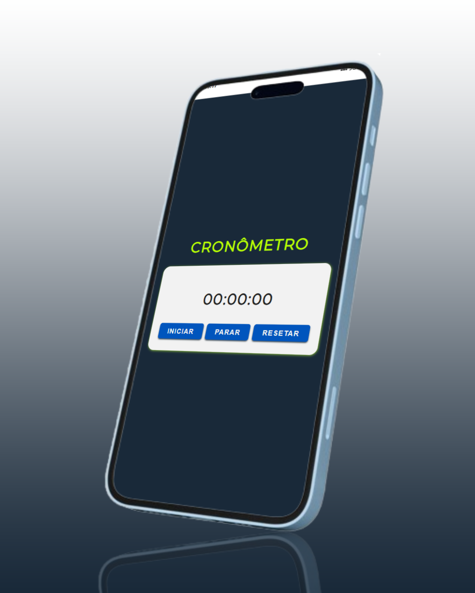

<h1>CRONÔMETRO</h1>

## 📝 Sobre

O projeto Cronômetro apresenta um contador de tempo que inclui horas, minutos, segundos e milisegundos. O design do projeto foi planejado tanto para dispositivos móveis quanto para desktops.

## ⚙ Funcionalidades

Para iniciar a cronometragem, aperte o botão "Iniciar" e, caso necessário, aperte "Parar" para congelar a contagem. O botão "Iniciar" retoma a contagem exatamente de quando foi pausada, e o botão "Resetar" zera o cronômetro.

## 🖥 Tecnologias

Este projeto foi desenvolvido com HTML, CSS e JavaScript.
